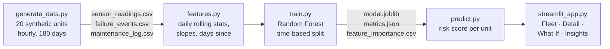

# Predictive Maintenance Demo 🔧

A small, end-to-end data science project for students:

**synthetic sensor data → feature engineering → ML model → failure-risk prediction → web dashboard**

> ⚠️ Synthetic data for educational purposes only. No real companies, sites or equipment.

---

## Architecture



| Folder / file | What it does |
|---|---|
| `src/generate_data.py` | Creates fake hourly sensor data, failures and maintenance |
| `src/features.py` | Turns hourly readings into one row per unit per day |
| `src/train.py` | Trains, evaluates and saves the model |
| `src/predict.py` | Loads the model and scores units |
| `app/streamlit_app.py` | The web dashboard |
| `tests/test_pipeline.py` | Quick pytest checks |
| `entrypoint.sh` | data → train → launch app (used by Docker) |

---

## Run in GitHub Codespaces (recommended)

1. Push this folder to a GitHub repository.
2. On GitHub click **Code → Codespaces → Create codespace on main**.
3. Wait ~2–3 minutes. The dev container builds the Docker image, generates data,
   trains the model and starts Streamlit automatically.
4. The **Streamlit UI** (port 8501) opens in a new browser tab. If it doesn't,
   open the **Ports** tab and click the 🌐 icon next to port 8501.
5. To restart the full pipeline later, run in the Codespaces terminal:
   ```bash
   make run
   ```
   (if port 8501 is already in use, the app is already running — just refresh the browser tab.)

## Run locally with Docker

```bash
docker compose up --build      # or: make docker-up
# open http://localhost:8501
```

## Run locally without Docker

```bash
python -m venv .venv && source .venv/bin/activate   # optional
pip install -r requirements.txt
make run          # generates data, trains, launches http://localhost:8501
make test         # runs pytest
```

Individual steps: `make data`, `make train`, `make predict`.

---

## How the synthetic data works

- **20 units**, 5 each of **Pump (PMP)**, **Motor (MTR)**, **Conveyor (CNV)**, **Compressor (CMP)**.
- **Hourly readings for 180 days**: temperature, vibration, current, pressure, rpm, operating hours.
- Each type has its own **normal baseline** (e.g. compressors run hotter and faster than conveyors),
  plus random noise and a day/night temperature cycle.
- **Slow wear**: vibration and temperature creep up slightly between maintenance visits
  and reset after each preventive maintenance (~every 25–35 days).
- **2–4 failures per unit**. In the **3–10 days before** a failure the signals degrade gradually
  and accelerate towards the failure. The pattern depends on the failure mode:

  | Failure mode | Main symptom |
  |---|---|
  | Bearing Wear | strong vibration increase |
  | Overheating | temperature rises |
  | Seal Leak | pressure drops |
  | Misalignment | vibration up, rpm slightly down |

  Current also becomes erratic. After the failure the unit is "repaired" → back to baseline.
- A few units are **degrading right now** (they will fail just after the data ends), so the
  dashboard has live high-risk units — just like in real life, the failure isn't logged yet.
- **Real-world mess**: ~1% missing values and occasional sensor spikes.
- **Label**: `failure_within_7d = 1` if the unit fails within the next 7 days.
- Fixed random seed **42** → everyone gets identical data and results.

### Avoiding data leakage
Each daily row uses only data **up to the end of that day** (backward-looking rolling windows,
forward-fill only). The train/test split is **by time** (first 75% of days train, last 25% test),
never shuffled — because in reality we always predict the future from the past.

---

## Demo Script (≈10 minutes)

| Time | Where | What to say / do |
|---|---|---|
| 0:00 | Slide / README | "Machines don't fail randomly — they usually warn us first. Can we learn those warnings from sensor data?" Show the Mermaid diagram. |
| 1:00 | Terminal | `make data` → point out 86,400 rows, 20 units, ~11% positive labels. Open `data/sensor_readings.csv` briefly. Mention it's synthetic. |
| 2:00 | `src/features.py` | Explain rolling windows (24h vs 7d), slopes = "is it getting worse?", days since maintenance. Stress **no peeking into the future**. |
| 3:00 | Terminal | `make train` → read the metrics aloud. Ask: *"Accuracy is ~94% — is that great?"* Explain that "always say OK" would already be ~86%. That's why we watch **recall**. |
| 4:30 | App → **Fleet Overview** | KPI cards, table sorted by risk. Point at the red **High** units. "Who would you send a technician to first?" |
| 5:30 | App → **Equipment Detail** | Pick the top High-risk unit. Show vibration/temperature rising. Then pick another unit (e.g. PMP-01) and show red dashed failure lines: signals ramp up *before* each line, and the risk curve rises a few days earlier. Green lines = maintenance. |
| 7:00 | App → **What-If Simulator** | Start at defaults (Low). Raise vibration to ~1.5× baseline and temperature by ~15% → risk climbs. Set *days since last failure* to 40 → High, "Schedule inspection within 48 hours". Ask students why recently repaired machines are lower risk. |
| 8:30 | App → **Model Insights** | Confusion matrix: missed failures (FN) vs false alarms (FP) — which costs more? Feature importance: slopes and vibration on top, matching how the data was built. |
| 9:30 | README | "Ideas to extend" — invite students to fork and try one. |

---

## Ideas to extend

- **RUL regression** – predict *remaining useful life* (hours until failure) instead of a yes/no label.
- **Anomaly detection** – use `IsolationForest` to flag unusual behaviour without any failure labels.
- **FastAPI endpoint** – serve `predict.py` as a REST API (`POST /predict`) for other systems.
- **MLflow tracking** – log parameters, metrics and models for every training run and compare them.
- **Scheduled retraining** – retrain weekly on new data (cron / GitHub Actions) and monitor model drift.
- Bonus: tune the decision threshold to trade precision for recall, or try gradient boosting.
